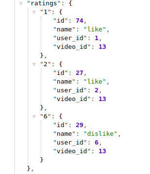
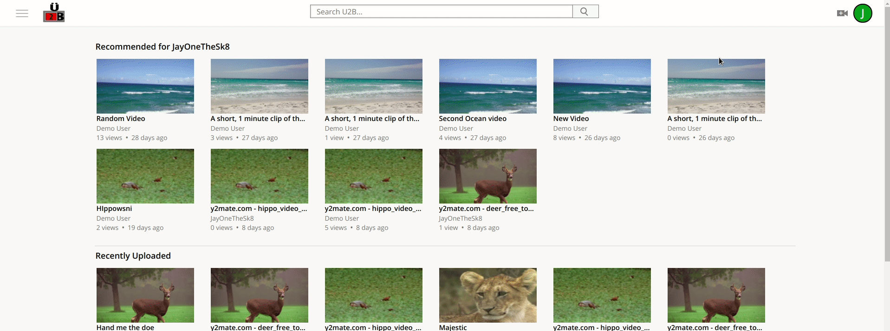

# U2B

[U2B](https://aa-u2b.herokuapp.com/#/) is a video sharing and uploading websites. Users can upload, watch, comment on, and like videos. Users can also subscribe to each other and get an aggregated list of videos only from those they have subscribed to.


U2B is built using React.js and Redux to manage the frontend and Rails and PostgreSQL to manage the backend. JBuilder is used to create JSON objects readable by the store. It implements full CRUD of `videos`, `comments`, `subscriptions`, and `ratings`. All videos are stored using AWS cloud service. Previews are images created using [FFmpeg](https://www.ffmpeg.org/) to take an initial snapshot of the sorted video and [mini-magick](https://github.com/minimagick/minimagick) gem to adjust the size.

# Features to Note

## Sorts Data by User IDs

Every video show page needs to know if the `current_user` has interacted with it before. Because there can potentially be millions of `ratings` or `subscriptions` to sift though, there must be a way to do this quickly to ease loading time. How I accomplished this was to load the incoming information by `user_id` into the state.

```ruby
@ratings.each do |rating|
  json.set! rating.user_id do
    json.partial! 'api/ratings/rating', rating: rating
  end
end
```
results in



Because the state is a javascript object, the only thing that the show page needs to look for is a `rating` under that username. This reduces time complexity O(n) linear to O(1) constant time.

### Thumbnail Editing

Upon creating a username, a user can edit their primary avatar and username. A preview shows up for better UX.


